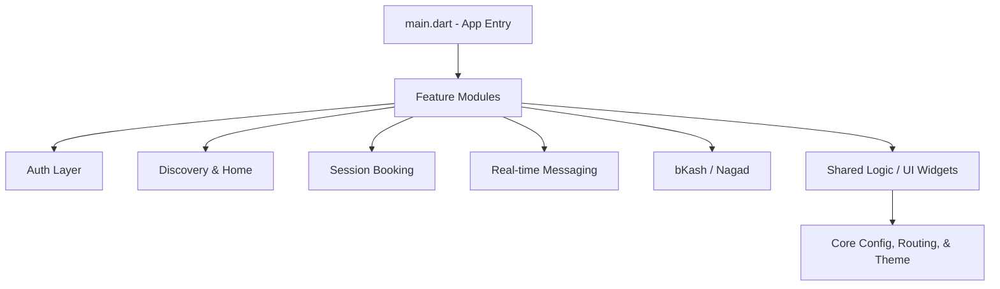

# 🎓 TutorBondhu: Elevating Academic Excellence

<div align="center">
  
</div>

**TutorBondhu** is a comprehensive, feature-rich mobile application designed to bridge the gap between students and expert tutors. Built with Flutter, it provides a seamless and trustworthy platform for discovering educators, managing session bookings, real-time communication, and secure, hassle-free payments.

---

## 🚀 Key Modules

### 🔍 Tutor Discovery & Profiling
*   **Smart Search:** Browse through extensive, categorized lists of qualified tutors right from the interactive home dashboard.
*   **Detailed Credentials:** View tutor experience, subject expertise, educational background, and availability.

### 📅 Smart Booking & Scheduling
*   **Session Management:** An intuitive, easy-to-use calendaring system to book tutoring sessions without friction.
*   **Progressive Flow:** Transparent review and summary screens before finalizing any session.

### 💬 Integrated Communication
*   **Real-Time Chat:** Built-in messaging system connecting students and tutors securely using Firebase Cloud Firestore.
*   **Instant Connectivity:** Discuss curriculum, share updates, and clarify doubts directly within the app.

### 💳 Seamless & Secure Payments
*   **Local Integrations:** Full support for local mobile financial services like **bKash** and **Nagad**.
*   **Trust & Verification:** Smooth checkout flows, from gateway processing to success confirmations.

---

## 📸 Experience TutorBondhu

<div align="center">
  <table style="border-collapse: collapse; border: none;">
    <tr>
      <td align="center"><b>Splash & Onboarding</b></td>
      <td align="center"><b>Home Dashboard</b></td>
      <td align="center"><b>Tutor Details</b></td>
    </tr>
    <tr>
      <td></td>
      <td></td>
      <td></td>
    </tr>
    <tr>
      <td align="center"><b>Booking Selection</b></td>
      <td align="center"><b>Review & Summary</b></td>
      <td align="center"><b>Payment Gateway</b></td>
    </tr>
    <tr>
      <td></td>
      <td></td>
      <td></td>
    </tr>
    <tr>
      <td align="center"><b>Processing Request</b></td>
      <td align="center"><b>Success Confirmation</b></td>
      <td align="center"><b>Payment Methods</b></td>
    </tr>
    <tr>
      <td></td>
      <td></td>
      <td></td>
    </tr>
  </table>
</div>

---

## 🛠️ Technical Excellence

TutorBondhu is engineered for scalable performance and a highly responsive user experience:

*   **Framework:** [Flutter](https://flutter.dev) (Cross-platform Development)
*   **State Management:** [Riverpod](https://riverpod.dev) (`flutter_riverpod` for declarative state)
*   **Backend & Auth:** [Firebase](https://firebase.google.com/) (Authentication & Cloud Firestore)
*   **Routing:** [Go Router](https://pub.dev/packages/go_router) (Declarative deep-linking navigation)
*   **Design System:** Stunning visual identity utilizing custom typography (`google_fonts` - Plus Jakarta Sans) and `flutter_staggered_animations` for premium interactions.

---

## 🏗️ Architecture

The application adopts a **Feature-First / Clean Architecture** approach to guarantee maintainability and seamless collaboration across teams:



---

## 🏁 Getting Started

### Prerequisites
*   Flutter SDK (3.8.1 or higher)
*   Dart SDK (^3.8.1)
*   Active Firebase Project configured for this application (ensure `google-services.json` and `GoogleService-Info.plist` are correctly placed).

### Installation

1. **Clone the repository:**
   ```bash
   git clone <https://github.com/MdKhanBahadurSadi/TutorBondhu.git>
   ```

2. **Navigate to the directory:**
   ```bash
   cd tutor_bondhu
   ```

3. **Install dependencies:**
   ```bash
   flutter pub get
   ```

4. **Launch the app:**
   ```bash
   flutter run
   ```

---

## ⚖️ License
Distributed under the MIT License. See `LICENSE` for more information.

---

**Developed by Md Khan Bahadur Sadi**  
*Connecting minds, empowering futures.*
